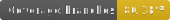

# 🎨 LeUX

<a href="https://twitter.com/alcquis" target="\_parent">
	
</a>
<a href="https://www.npmjs.com/package/leux" target="\_parent">
  
</a>
<a href="https://www.npmjs.com/package/leux" target="\_parent">
  
</a>
<a href="https://nodejs.org/en/blog/release/v14.17.3/" target="\_parent">
  
</a>

<div>
	
	
	
	
</div>

> A awesome React component library. (**_Work in progress_**)

## 🎈 Overview

Leux is a simple, lightweight, and fast React framework. It's built with the latest web technologies and is fully responsive.
The framework is designed to be easy to use and easy to learn.
The idea came when i have to redesign my own projects with the same UI/UX identity, so i decided to make it public for everyone as a library.

## 📦 Install

You can install this package using the following commands

```bash
npm install leux

# or

yarn add leux
```

### ✨ CSS

To upload the CSS styles, you can move the **leux.min.css** from the **node_modules/leux/dist** folder to your project folder and import it in your **index.html** file.

### 📌 To-do

- Create a custom syntax highlighter with refractor

## Next steps:

- [ ] components
  - [x] Button
  - [x] Topography
  - [x] Grid
  - [ ] Form
    - [ ] Input
    - [ ] Select
    - [ ] Checkbox
    - [ ] Textarea
    - [ ] Radio
    - [ ] Switch
  - [ ] Table
  - [ ] Modal
  - [ ] Tooltip
  - [ ] Popover
  - [ ] Toast
  - [ ] Collapse
  - [ ] Dropdown
  - [ ] Progress/Spinner
  - [x] Box
  - [X] Badge
  - [ ] Alert
  - [ ] Breadcrumb
- [ ] add more tests
- [ ] improve documentation
- [ ] build and publish the docs
